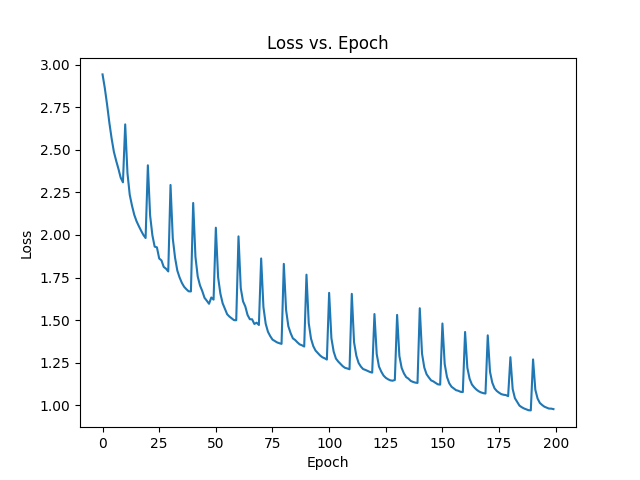

# AlphaFour

A Connect Four AI that learns from scratch via self-play deep reinforcement learning.

Training:
```
python3 train.py
```

Running:
```
python3 main.py
```

Results (~9 hours of training): <br>


Generation 0: <br>


Generation 5: <br>


Generation 10: <br>


Generation 20: <br>

